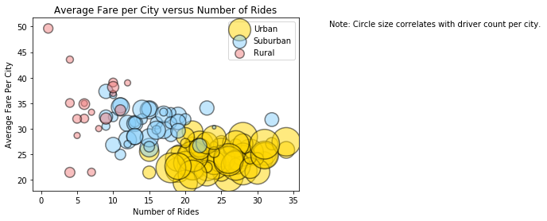
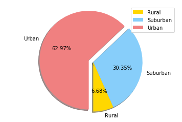
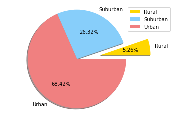
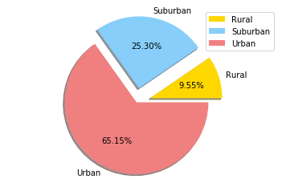

# Analysis

 1. There is a correlation between number of rides and the average fare per city. Urban cities  
    the highest number of rides, the highest number of drivers and had the lowest average fare  
    of the three city types.
 2. Urban cities have the highest percentage of total fares at 62.97%.
 3. Even though rural cities had the highest average fare per city, the rural cities had the 
    smallest segment of th total fares by city pie chart at 6.68%.
 4. Urban cities had the largest percentage of total rides.
 5. Urban cities had the largest percentage of drivers.


```python
# Dependencies

import pandas as pd
import matplotlib.pyplot as plt
import numpy as np
import seaborn as sns
```


```python
#Import city and and ride data csv files.

#City data

city_data = "Resources/city_data.csv"

#Ride data

ride_data = "Resources/ride_data.csv"
```


```python
#Read city data file with the pandas library.

city_data_df = pd.read_csv(city_data)
city_data_df.head()

#duplicate  city so drop dups
city_data_df = city_data_df.drop_duplicates('city')
city_data_df.head()
```


<div>
<style>
    .dataframe thead tr:only-child th {
        text-align: right;
    }

    .dataframe thead th {
        text-align: left;
    }

    .dataframe tbody tr th {
        vertical-align: top;
    }
</style>
<table border="1" class="dataframe">
  <thead>
    <tr style="text-align: right;">
      <th></th>
      <th>city</th>
      <th>driver_count</th>
      <th>type</th>
    </tr>
  </thead>
  <tbody>
    <tr>
      <th>0</th>
      <td>Kelseyland</td>
      <td>63</td>
      <td>Urban</td>
    </tr>
    <tr>
      <th>1</th>
      <td>Nguyenbury</td>
      <td>8</td>
      <td>Urban</td>
    </tr>
    <tr>
      <th>2</th>
      <td>East Douglas</td>
      <td>12</td>
      <td>Urban</td>
    </tr>
    <tr>
      <th>3</th>
      <td>West Dawnfurt</td>
      <td>34</td>
      <td>Urban</td>
    </tr>
    <tr>
      <th>4</th>
      <td>Rodriguezburgh</td>
      <td>52</td>
      <td>Urban</td>
    </tr>
  </tbody>
</table>
</div>


```python
# Read ride data file with the pandas library.

ride_data_df = pd.read_csv(ride_data)
ride_data_df.head()
```


<div>
<style>
    .dataframe thead tr:only-child th {
        text-align: right;
    }

    .dataframe thead th {
        text-align: left;
    }

    .dataframe tbody tr th {
        vertical-align: top;
    }
</style>
<table border="1" class="dataframe">
  <thead>
    <tr style="text-align: right;">
      <th></th>
      <th>city</th>
      <th>date</th>
      <th>fare</th>
      <th>ride_id</th>
    </tr>
  </thead>
  <tbody>
    <tr>
      <th>0</th>
      <td>Sarabury</td>
      <td>2016-01-16 13:49:27</td>
      <td>38.35</td>
      <td>5403689035038</td>
    </tr>
    <tr>
      <th>1</th>
      <td>South Roy</td>
      <td>2016-01-02 18:42:34</td>
      <td>17.49</td>
      <td>4036272335942</td>
    </tr>
    <tr>
      <th>2</th>
      <td>Wiseborough</td>
      <td>2016-01-21 17:35:29</td>
      <td>44.18</td>
      <td>3645042422587</td>
    </tr>
    <tr>
      <th>3</th>
      <td>Spencertown</td>
      <td>2016-07-31 14:53:22</td>
      <td>6.87</td>
      <td>2242596575892</td>
    </tr>
    <tr>
      <th>4</th>
      <td>Nguyenbury</td>
      <td>2016-07-09 04:42:44</td>
      <td>6.28</td>
      <td>1543057793673</td>
    </tr>
  </tbody>
</table>
</div>


```python
pyber_data = pd.merge(city_data_df, ride_data_df, on="city")
pyber_data.head()
```


<div>
<style>
    .dataframe thead tr:only-child th {
        text-align: right;
    }

    .dataframe thead th {
        text-align: left;
    }

    .dataframe tbody tr th {
        vertical-align: top;
    }
</style>
<table border="1" class="dataframe">
  <thead>
    <tr style="text-align: right;">
      <th></th>
      <th>city</th>
      <th>driver_count</th>
      <th>type</th>
      <th>date</th>
      <th>fare</th>
      <th>ride_id</th>
    </tr>
  </thead>
  <tbody>
    <tr>
      <th>0</th>
      <td>Kelseyland</td>
      <td>63</td>
      <td>Urban</td>
      <td>2016-08-19 04:27:52</td>
      <td>5.51</td>
      <td>6246006544795</td>
    </tr>
    <tr>
      <th>1</th>
      <td>Kelseyland</td>
      <td>63</td>
      <td>Urban</td>
      <td>2016-04-17 06:59:50</td>
      <td>5.54</td>
      <td>7466473222333</td>
    </tr>
    <tr>
      <th>2</th>
      <td>Kelseyland</td>
      <td>63</td>
      <td>Urban</td>
      <td>2016-05-04 15:06:07</td>
      <td>30.54</td>
      <td>2140501382736</td>
    </tr>
    <tr>
      <th>3</th>
      <td>Kelseyland</td>
      <td>63</td>
      <td>Urban</td>
      <td>2016-01-25 20:44:56</td>
      <td>12.08</td>
      <td>1896987891309</td>
    </tr>
    <tr>
      <th>4</th>
      <td>Kelseyland</td>
      <td>63</td>
      <td>Urban</td>
      <td>2016-08-09 18:19:47</td>
      <td>17.91</td>
      <td>8784212854829</td>
    </tr>
  </tbody>
</table>
</div>


```python
#Find the average fare per city.

average_fare = pyber_data.groupby("city")["fare"].mean()
average_fare
```


    city
    Alvarezhaven            23.928710
    Alyssaberg              20.609615
    Anitamouth              37.315556
    Antoniomouth            23.625000
    Aprilchester            21.981579
    Arnoldview              25.106452
    Campbellport            33.711333
    Carrollbury             36.606000
    Carrollfort             25.395517
    Clarkstad               31.051667
    Conwaymouth             34.591818
    Davidtown               22.978095
    Davistown               21.497200
    East Cherylfurt         31.416154
    East Douglas            26.169091
    East Erin               24.478214
    East Jenniferchester    32.599474
    East Leslie             33.660909
    East Stephen            39.053000
    East Troybury           33.244286
    Edwardsbury             26.876667
    Erikport                30.043750
    Eriktown                25.478947
    Floresberg              32.310000
    Fosterside              23.034583
    Hernandezshire          32.002222
    Horneland               21.482500
    Jacksonfort             32.006667
    Jacobfort               24.779355
    Jasonfort               27.831667
                              ...    
    South Roy               26.031364
    South Shannonborough    26.516667
    Spencertown             23.681154
    Stevensport             31.948000
    Stewartview             21.614000
    Swansonbury             27.464706
    Thomastown              30.308333
    Tiffanyton              28.510000
    Torresshire             24.207308
    Travisville             27.220870
    Vickimouth              21.474667
    Webstertown             29.721250
    West Alexis             19.523000
    West Brandy             24.157667
    West Brittanyton        25.436250
    West Dawnfurt           22.330345
    West Evan               27.013333
    West Jefferyfurt        21.072857
    West Kevintown          21.528571
    West Oscar              24.280000
    West Pamelaborough      33.799286
    West Paulport           33.278235
    West Peter              24.875484
    West Sydneyhaven        22.368333
    West Tony               29.609474
    Williamchester          34.278182
    Williamshire            26.990323
    Wiseborough             22.676842
    Yolandafurt             27.205500
    Zimmermanmouth          28.301667
    Name: fare, Length: 125, dtype: float64


```python
#Find the total rides per city.

total_rides = pyber_data.groupby("city")["ride_id"].count()
total_rides
```


    city
    Alvarezhaven            31
    Alyssaberg              26
    Anitamouth               9
    Antoniomouth            22
    Aprilchester            19
    Arnoldview              31
    Campbellport            15
    Carrollbury             10
    Carrollfort             29
    Clarkstad               12
    Conwaymouth             11
    Davidtown               21
    Davistown               25
    East Cherylfurt         13
    East Douglas            22
    East Erin               28
    East Jenniferchester    19
    East Leslie             11
    East Stephen            10
    East Troybury            7
    Edwardsbury             27
    Erikport                 8
    Eriktown                19
    Floresberg              10
    Fosterside              24
    Hernandezshire           9
    Horneland                4
    Jacksonfort              6
    Jacobfort               31
    Jasonfort               12
                            ..
    South Roy               22
    South Shannonborough    15
    Spencertown             26
    Stevensport              5
    Stewartview             30
    Swansonbury             34
    Thomastown              24
    Tiffanyton              13
    Torresshire             26
    Travisville             23
    Vickimouth              15
    Webstertown             16
    West Alexis             20
    West Brandy             30
    West Brittanyton        24
    West Dawnfurt           29
    West Evan               12
    West Jefferyfurt        21
    West Kevintown           7
    West Oscar              29
    West Pamelaborough      14
    West Paulport           17
    West Peter              31
    West Sydneyhaven        18
    West Tony               19
    Williamchester          11
    Williamshire            31
    Wiseborough             19
    Yolandafurt             20
    Zimmermanmouth          24
    Name: ride_id, Length: 125, dtype: int64


```python
#Find the total number of drivers per city.

total_drivers = pyber_data.groupby("city")["driver_count"].mean()
total_drivers
```


    city
    Alvarezhaven            21
    Alyssaberg              67
    Anitamouth              16
    Antoniomouth            21
    Aprilchester            49
    Arnoldview              41
    Campbellport            26
    Carrollbury              4
    Carrollfort             55
    Clarkstad               21
    Conwaymouth             18
    Davidtown               73
    Davistown               25
    East Cherylfurt          9
    East Douglas            12
    East Erin               43
    East Jenniferchester    22
    East Leslie              9
    East Stephen             6
    East Troybury            3
    Edwardsbury             11
    Erikport                 3
    Eriktown                15
    Floresberg               7
    Fosterside              69
    Hernandezshire          10
    Horneland                8
    Jacksonfort              6
    Jacobfort               52
    Jasonfort               25
                            ..
    South Roy               35
    South Shannonborough     9
    Spencertown             68
    Stevensport              6
    Stewartview             49
    Swansonbury             64
    Thomastown               1
    Tiffanyton              21
    Torresshire             70
    Travisville             37
    Vickimouth              13
    Webstertown             26
    West Alexis             47
    West Brandy             12
    West Brittanyton         9
    West Dawnfurt           34
    West Evan                4
    West Jefferyfurt        65
    West Kevintown           5
    West Oscar              11
    West Pamelaborough      27
    West Paulport            5
    West Peter              61
    West Sydneyhaven        70
    West Tony               17
    Williamchester          26
    Williamshire            70
    Wiseborough             55
    Yolandafurt              7
    Zimmermanmouth          45
    Name: driver_count, Length: 125, dtype: int64


```python
city_type = city_data_df.set_index('city')['type']


city_type.value_counts()
```


    Urban       66
    Suburban    41
    Rural       18
    Name: type, dtype: int64


```python
pyber_cities = pd.DataFrame({"Average Fare per City":average_fare,
                 "Number of Rides": total_rides,
                 "Number of Drivers": total_drivers,
                 "City Type": city_type
})
pyber_cities.head()
```


<div>
<style>
    .dataframe thead tr:only-child th {
        text-align: right;
    }

    .dataframe thead th {
        text-align: left;
    }

    .dataframe tbody tr th {
        vertical-align: top;
    }
</style>
<table border="1" class="dataframe">
  <thead>
    <tr style="text-align: right;">
      <th></th>
      <th>Average Fare per City</th>
      <th>City Type</th>
      <th>Number of Drivers</th>
      <th>Number of Rides</th>
    </tr>
  </thead>
  <tbody>
    <tr>
      <th>Alvarezhaven</th>
      <td>23.928710</td>
      <td>Urban</td>
      <td>21</td>
      <td>31</td>
    </tr>
    <tr>
      <th>Alyssaberg</th>
      <td>20.609615</td>
      <td>Urban</td>
      <td>67</td>
      <td>26</td>
    </tr>
    <tr>
      <th>Anitamouth</th>
      <td>37.315556</td>
      <td>Suburban</td>
      <td>16</td>
      <td>9</td>
    </tr>
    <tr>
      <th>Antoniomouth</th>
      <td>23.625000</td>
      <td>Urban</td>
      <td>21</td>
      <td>22</td>
    </tr>
    <tr>
      <th>Aprilchester</th>
      <td>21.981579</td>
      <td>Urban</td>
      <td>49</td>
      <td>19</td>
    </tr>
  </tbody>
</table>
</div>


```python
#Urban
urban = pyber_cities.loc[pyber_cities["City Type"]== "Urban"]

#suburban
suburban = pyber_cities.loc[pyber_cities["City Type"]== "Suburban"]

#rural
rural = pyber_cities.loc[pyber_cities["City Type"]== "Rural"]
```


```python
#Urban
plt.scatter(urban["Number of Rides"], urban["Average Fare per City"], color = "gold", edgecolors="black", s = urban["Number of Drivers"]*20, label = "Urban", alpha = 0.5, linewidth = 1.5)

#Suburban
plt.scatter(suburban["Number of Rides"], suburban["Average Fare per City"], color = "lightskyblue", edgecolors ="black", s = suburban["Number of Drivers"]*20, label = "Suburban", alpha = 0.5, linewidth = 1.5)

#Rural
plt.scatter(rural["Number of Rides"], rural["Average Fare per City"], color = "lightcoral", edgecolors = "black", s = rural["Number of Drivers"]*20, label = "Rural", alpha = 0.5, linewidth = 1.5)

#Add title, x axis label and y axis label.
plt.title("Average Fare per City versus Number of Rides")
plt.xlabel("Number of Rides")
plt.ylabel("Average Fare Per City")
plt.text(40, 50,"Note: Circle size correlates with driver count per city.")

#Add the legend.
plt.legend(loc= "upper right")

#Show plot.
plt.show()
```





```python
#Sum of fares by city type.

city_fare_pie = pyber_data.groupby(["type"])["fare"].sum()
city_fare_pie
```


    type
    Rural        4255.09
    Suburban    19317.88
    Urban       40078.34
    Name: fare, dtype: float64


```python
#Use the City Pie index for wedge labels.

city_fare_pie.index
```


    Index(['Rural', 'Suburban', 'Urban'], dtype='object', name='type')


```python
#Set the colors of each section of the pie chart.
colors = ["gold", "lightskyblue", "lightcoral"]

#Only explode the third section of the pie chart.

explode = (0,0, 0.1)

#Create the pie chart.
plt.pie(city_fare_pie, labels = city_fare_pie.index, autopct = "%1.2f%%", colors = colors, explode = explode, shadow = True, startangle = 270)

#Tell Matplotlib that we want a pie chart with equal axes.
plt.axis("equal")

#Add the legend.
plt.legend(loc = "upper right")

#Show the chart.
plt.show()
```





```python
#Total rides by city type.

city_rides_pie = pyber_data.groupby(["type"])["ride_id"].count()
city_rides_pie
```


    type
    Rural        125
    Suburban     625
    Urban       1625
    Name: ride_id, dtype: int64


```python
#Use the City Pie index for wedge labels.
city_rides_pie.index

#Set the colors of each section of the pie chart.
colors = ["gold", "lightskyblue", "lightcoral"]

#Only explode the first section of the pie chart.
explode = (0.5,0,0)

#Create the pie chart.
plt.pie(city_rides_pie, labels = city_fare_pie.index, autopct = "%1.2f%%", colors = colors, explode = explode, shadow = True)

#Tell Matplotlib that we wnat the pie chart to have equal axes.
plt.axis("equal")

#Add the legend.
plt.legend(loc = "upper right")

#Show the chart.
plt.show()
```





```python
#Total driver count.

city_drivers_pie = pyber_data.groupby(["type"])["driver_count"].mean()
city_drivers_pie
```


    type
    Rural        5.816000
    Suburban    15.414400
    Urban       39.692923
    Name: driver_count, dtype: float64


```python
#Use the City Pie index for the wedge labels.
city_drivers_pie.index

#Set the colors of each section of the pie chart.
colors = ["gold", "lightskyblue", "lightcoral"]

#explode the first and second segments of the pie chart.

explode = (0.2,0.2,0)

#Create the pie chart.
plt.pie(city_drivers_pie, labels = city_fare_pie.index, autopct = "%1.2f%%", colors = colors, explode = explode, shadow = True)

#Tell Matplotlib that we want the chart to have equal axes.
plt.axis("equal")

#Add the legend.
plt.legend(loc = "upper right")

#Show the pie chart.
plt.show()
```




